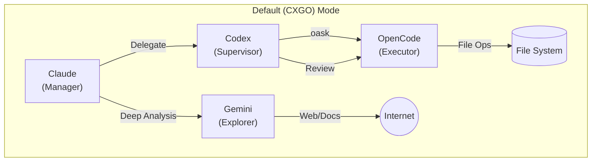
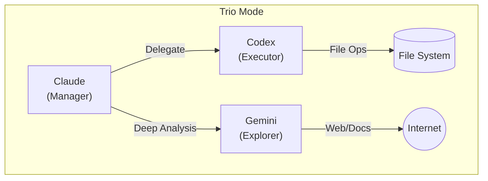

<div align="center">

# cca (Claude Code AutoFlow)

**Multi-Model Interconnection, Automated Collaboration**

**多模型互联，自动化协作**

<p>
  
  
</p>
<p>
  
  
</p>


**English** | [中文](README_zh.md)

</div>

---

**Claude Code AutoFlow (cca)** is a structured task automation workflow system designed for AI-assisted development. It enables Claude to plan and execute complex tasks autonomously with dual-design validation.

Two core capabilities:
- **Seamless role-based routing**: Configure roles once, and hooks/skills automatically route work to the right executor in the background (no extra commands to remember), reducing context usage and cost.
- **End-to-end automation for complex tasks**: Use `/auto <task>` to generate a plan, then `/auto run` to drive the remaining steps automatically.

## 🔗 Dependency Chain

```
WezTerm  →  ccb (Claude Code Bridge)  →  cca (Claude Code AutoFlow)
```

- **WezTerm**: Terminal emulator with pane control support
- **ccb**: Bridge connecting terminal to AI context
- **cca**: High-level workflow engine for task automation

## ✨ Core Features

| Feature | Description |
| :--- | :--- |
| **Task Planning** | Dual-design (Claude + Codex) plan generation |
| **Auto Execution** | Autoloop daemon triggers `/tr` automatically after planning |
| **State Management** | `state.json` as Single Source of Truth |
| **Context Awareness** | Auto `/clear` when context usage exceeds threshold |

## 🚀 Installation

### 1. Install WezTerm
Download from: [https://wezfurlong.org/wezterm/](https://wezfurlong.org/wezterm/)

### 2. Install ccb (Claude Code Bridge)
```bash
git clone https://github.com/bfly123/claude_code_bridge.git
cd claude_code_bridge
./install.sh install
```

### 3. Install cca (AutoFlow)

**Option A: Via ccb (Recommended)**
```bash
ccb update cca         # Install or update cca via ccb
```

Other ccb commands for cca:
```bash
ccb -v                 # Show CCA version or install suggestion
ccb update             # Update both CCB and CCA
ccb update cca         # Install/update CCA only
```

**Option B: Manual installation**
```bash
git clone https://github.com/bfly123/claude_code_autoflow.git
cd claude_code_autoflow
./install.sh install
```

### Windows (PowerShell)

**Prerequisites**: PowerShell 5.1+ (Windows 10+)

**Installation**:
```powershell
git clone https://github.com/bfly123/claude_code_autoflow.git
cd claude_code_autoflow
# Copy cca.ps1 to your PATH or run directly
Copy-Item cca.ps1 $env:LOCALAPPDATA\Microsoft\WindowsApps\cca.ps1
```

**Usage**:
```powershell
cca.ps1 <command> [options]
# Or if in PATH:
cca <command> [options]
```

## 📖 Usage

### Prerequisites: Start Codex Session

Before using CCA, you need to start a Codex session in a separate terminal pane:

```bash
# In WezTerm, open a new pane and start Codex
codex
```

Verify Codex is running:
```bash
cping    # Should return "Codex connection OK"
```

### CLI Commands

```bash
cca <command> [options]
```

#### 1. Project Initialization (`cca add`)

```bash
cca add .
```
**Function**: Initializes the AutoFlow environment for the current project.
**Generated Files**:
- **.claude/**: Contains project-specific AutoFlow skills and commands.
- **.autoflow/**: Stores the `roles.json` role configuration file.
- **CLAUDE.md**: Dynamically generated Prompt policy and routing rules based on role configuration.
- **AGENTS.md**: (When using OpenCode) Contains supervision policies for Codex.

#### 2. Role Preset Switching (`cca roles`)

Supports quick switching between different role combinations. Switching automatically refreshes `CLAUDE.md` and `AGENTS.md`.

- **List Presets**:
  ```bash
  cca roles list
  ```
- **Switch to Trio Mode** (Claude + Codex + Gemini):
  ```bash
  cca roles trio
  ```
  *Scenario*: Codex executes all operations directly (no OpenCode).
- **Switch to Default Mode** (Claude + Codex + OpenCode + Gemini):
  ```bash
  cca roles default
  ```
  *Scenario*: Standard **CXGO** combination, suitable for complex project development.

#### Mode Diagrams

**1. Default (CXGO) Mode**
*Claude manages, Codex supervises and gateways, OpenCode handles the heavy lifting, Gemini provides knowledge.*



**2. Trio Mode**
*Simplified mode without OpenCode. Codex executes operations directly.*



#### 3. Other Common Commands

| Command | Description |
| :--- | :--- |
| `cca update` | Update cca core components and global skill definitions. |
| `cca refresh` | Force refresh configuration (e.g., `CLAUDE.md`) after manually modifying `roles.json`. |
| `cca version` | Show version information. |
| `cca delete` | Remove AutoFlow config from a project. |

### Slash Commands (In-Session)

| Command | Description |
| :--- | :--- |
| `/auto <requirement>` | Create task plan (invokes tp skill) |
| `/auto run` | Execute current step (invokes tr skill) |
| `/file-op` | Delegate file operations to Codex |
| `/review` | Trigger cross-review |
| `/roles show` | Show current role configuration |

### Workflow: Claude Plans, Codex Executes

CCA enforces a **separation of concerns**:
- **Claude**: Plans tasks, constructs requests (plan mode optional)
- **Codex**: Executes file modifications and commands

```
User Request → Claude (Plan) → /file-op → Codex (Execute) → Review
```

#### For Simple Tasks
```bash
# 1. Enable AutoFlow for your project
cca add .

# 2. (Optional) Customize roles in .autoflow/roles.json

# 3. Refresh Claude session to load new config
cca refresh

# 4. Open ccb and start working
ccb
```

#### Quick Start Example
```bash
# 1. Start Codex in a separate pane
codex

# 2. In Claude session, enable AutoFlow for your project
cca add .

# 3. Ask Claude to make changes - it will automatically delegate to Codex
"Please add a login function to auth.py"
# Claude constructs FileOpsREQ → Codex executes → Returns result
```

#### For Complex Tasks (AutoFlow)
```bash
/auto implement user authentication system
# Creates plan with dual-design → autoloop triggers execution
```

## 🧠 Gemini Large Codebase Analysis

Leveraging the 1 million+ token context window of Gemini 1.5 Pro/Flash, CCA integrates dedicated large-scale code analysis capabilities.

**Use Cases**:
- Reading more than 5 files or analyzing entire directory structures.
- Analyzing project architecture, dependencies, or suggesting refactoring.
- Answering macro-level questions like "What is this project?" or "Explain the auth logic".

**Advantages**:
- **Massive Context**: Can ingest the core files of an entire repository at once, avoiding the "keyhole view" of standard models.
- **Macro Perspective**: Excels at cross-file dependencies and system-level design.

**How to Use**:
- Explicitly: Use the `gask` command
  ```bash
  gask "Please read the src directory and analyze the current routing architecture"
  ```
- Role Routing: If `codebase_explorer="gemini"` is configured (default), Claude will automatically route large-scale analysis tasks to Gemini.

## 🎭 Role Configuration

Role configuration controls which model/tool is used for each workflow role.

### Configuration Files
- Project: `<repo>/.autoflow/roles.json`

Config is project-local only (no inheritance from parent directories).

### Roles and Allowed Values
Roles are configured in `<repo>/.autoflow/roles.json`:
- `executor`: `codex`, `opencode`, `codex+opencode`
- `reviewer`: `codex`, `gemini`
- `documenter`: `codex`, `gemini`
- `designer`: `claude`, `codex`, `gemini` (use a list, e.g. `["claude","codex"]`)
- `searcher`: `claude`, `codex`, `gemini`, `opencode` (legacy)
- `web_searcher`: `claude`, `codex`, `gemini`, `opencode` (WebSearch/WebFetch)
- `repo_searcher`: `claude`, `codex`, `gemini`, `opencode` (Grep/Glob and repo-search Bash like `rg`/`grep`/`git grep`; enforced only when `repo_search_enforced=true`)
- `repo_search_enforced`: `true`/`false` (default: false) - Block repo-search when `repo_searcher != claude`
- `git_manager`: `claude`, `codex`, `opencode`, `gemini`
- `plan_mode_enforced`: `true`/`false` (default: false) - Block ExitPlanMode when true

Default template installed by `cca add`:
- `executor=codex+opencode`, `web_searcher=gemini`, `repo_searcher=codex`, `repo_search_enforced=true`

This default setup is called **CXGO**: Claude (Control) + Codex (Supervise/Gateway) + Gemini (Web research/docs) + OpenCode (Execution).

### Chained Executor Mode (`codex+opencode`)
When `executor` is set to `codex+opencode`:
1. Claude delegates execution to Codex via `cask`.
2. Codex refines the task and delegates file changes to OpenCode via `oask`.
3. Codex reviews/iterates on OpenCode results and returns a consolidated outcome back to Claude.

### Example
```json
{
  "schemaVersion": 1,
  "enabled": true,
  "executor": "opencode",
  "reviewer": "gemini",
  "documenter": "gemini",
  "designer": ["claude", "codex"]
}
```

## 📄 License

[AGPL-3.0](LICENSE)

---

<details>
<summary>📜 Version History</summary>

### v1.8.0
- Architecture refactor: install.sh only installs cca command (no global ~/.claude/ changes)
- Config is now project-local only (no parent directory inheritance)
- cca update: auto-detect and migrate legacy global config to project-local
- cca remove: interactive cleanup with confirmation
- cca-roles-hook: removed parent directory traversal for config lookup

### v1.7.1
- Make AutoFlow skills/commands project-local (`<repo>/.claude/`) via `cca add`
- Refactor `install.sh`/`cca update`: no global `~/.claude` skills install
- Refactor `cca delete`: interactive cleanup of project `.claude` + hooks + policy block

### v1.7.0
- Change default searcher role from claude to codex
- Add 'For Simple Tasks' quick setup guide in README

### v1.6.0
- Add Claude manager role in CLAUDE.md template
- Add plan_mode_enforced config for ExitPlanMode blocking
- Fix cask/oask/gask delegation commands being blocked
- Add searcher and git_manager roles

### v1.5.0
- Fix hooks format for Claude Code new API
- Remove dead code

### v1.4.0
- Fix cca update: sync bin tools after git pull
- Fix cca update: refresh project configs (settings.json, CLAUDE.md)
- Fix commands sync: use .cca-owned manifest to mirror commands
- Add cca add: auto-inject CLAUDE.md workflow policy

### v1.3.0
- Add roles hardening: Codex self-resolves roles from config files
- Add cca-roles-hook (Python): structured output with config signature marker
- Add /file-op executor routing: codex (direct) or opencode (via oask)
- Update CLAUDE.md with default workflow rules
- Add comprehensive test suite (11 test cases)

### v1.2.0
- Add bilingual slogan and language switch
- Add centered layout with colorful badges

### v1.1.0
- Add Windows PowerShell support (cca.ps1)
- Add role configuration system (P0: reviewer/documenter/designer)
- Add OpenCode executor support (P1: executor routing)
- Add Claude plan mode persistence (Preflight mode check)
- Fix macOS bash 3.2/4.3 empty array compatibility
- Add ask-gemini skill for Gemini integration

### v1.0.0
- Initial release
- Core AutoFlow workflow (tp/tr)
- Dual-design validation
- Autoloop daemon
- State management with state.json

</details>
