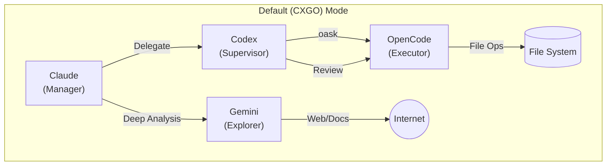
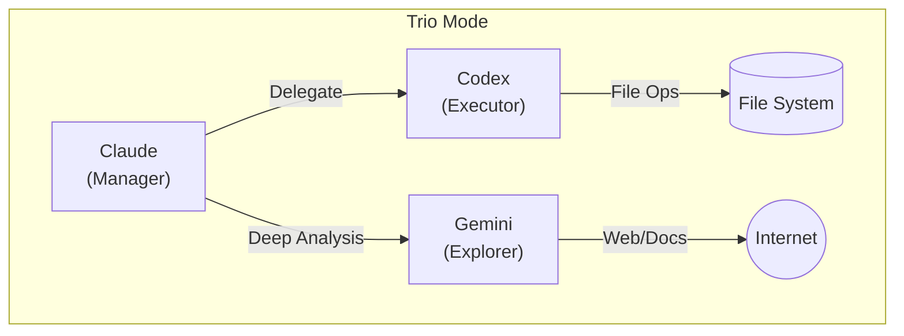

<div align="center">

# cca (Claude Code AutoFlow)

**Multi-Model Interconnection, Automated Collaboration**

**多模型互联，自动化协作**

<p>
  
  
</p>
<p>
  
  
</p>


[English](README.md) | **中文**

</div>

---

**Claude Code AutoFlow (cca)** 是一个专为 AI 辅助开发设计的结构化任务自动化工作流系统。
功能1：通过角色设置，无感体验，不需要记忆任何命令和指令，和直接使用claude没有任何不同，后台hook 和 skill会自动帮你根据角色安排任务，显著降低cc的上下文和花费。
功能2：针对复杂任务：/auto + 任务，自动制定任务计划， /auto run 自动完成后续所有过程推进 （核心原理：通过cc负责宏观，cx负责微观进行任务分解和分步展开，自动清理步间上下文，并根据token消耗做substep的进一步展开。 让复杂任务得心应手）


## 🔗 依赖链

`cca` 位于自动化技术栈的顶层：

```
WezTerm  →  ccb (Claude Code Bridge)  →  cca (Claude Code AutoFlow)
```

- **WezTerm**: 终端模拟器基础。
- **ccb**: 连接终端与 AI 上下文的桥梁。
- **cca**: 角色管理和任务自动化工作流引擎。

## ✨ 核心功能

| 功能 | 命令 | 说明 |
| :--- | :--- | :--- |
| **任务规划** | `/auto [需求]` | 生成结构化计划并初始化状态机。 |
| **任务执行** | `/auto run` | 执行当前步骤，包含双重设计 (Dual-Design) 验证。 |
| **自动化** | `autoloop` | 后台守护进程，实现持续的上下文感知执行。 |
| **状态管理** | SSOT | 使用 `state.json` 作为任务状态的唯一数据源。 |

## 🧠 Gemini 大代码分析

得益于 Gemini 1.5 Pro/Flash 拥有的 100万+ Token 上下文窗口，项目集成了专门的大代码分析能力。

**适用场景**：
- 需要阅读超过 5 个文件或整个目录结构时。
- 进行项目架构分析、依赖梳理、重构建议时。
- "这是什么项目？"、"梳理一下鉴权逻辑" 等宏观问题。

**优势**：
- **超长上下文**：能够一次性容纳整个代码库的核心文件，避免 Codex 的"管中窥豹"。
- **宏观视角**：擅长处理跨文件依赖和系统级设计问题。

**如何使用**：
- 显式调用：使用 `gask` 命令
  ```bash
  gask "请阅读 src 目录，分析当前的路由架构设计"
  ```
- 角色路由：如果配置了 `codebase_explorer="gemini"`（默认），Claude 也会在遇到大范围分析任务时自动路由给 Gemini。

## 🎭 角色配置（适用于所有任务）

CCA 支持为不同工作分配不同模型角色。

### 配置位置分离

- **项目独立的角色设置**：`<project_root>/.autoflow/roles.json`

### 支持的角色字段

- **executor**：执行代码修改（例如 `codex`、`opencode`）
- **reviewer**：审查代码/逻辑（例如 `codex`、`gemini`）
- **documenter**：生成文档（例如 `codex`、`gemini`）
- **designer**：参与双重设计（例如 `["claude", "codex"]`）
- **searcher**：搜索（兼容旧字段；`claude`/`codex`/`gemini`/`opencode`）
- **web_searcher**：联网搜索（WebSearch/WebFetch；`claude`/`codex`/`gemini`/`opencode`）
- **repo_searcher**：本地搜索（Grep/Glob + Bash 的 `rg`/`grep`/`git grep`；`claude`/`codex`/`gemini`/`opencode`；仅当 `repo_search_enforced=true` 时强制委托）
- **repo_search_enforced**：是否强制把本地搜索委托给 `repo_searcher`（默认 `false`）
- **git_manager**：Git 变更操作（`claude`/`codex`/`gemini`/`opencode`）

`cca add` 安装的默认模板：
- `executor=codex+opencode`，`web_searcher=gemini`，`repo_searcher=codex`，`repo_search_enforced=true`

这套默认组合称为 **CXGO**：Claude（总控）+ Codex（监督/网关）+ Gemini（联网搜索/文档）+ OpenCode（执行）。

### 链式角色管理

当 exexutor 为 codex+opencode时，claude会将任务下发给codex  codex形成详细计划，然后codex将直接调用opencode执行并审查迭代，最终将结果返回cc。让牛马发挥它应有的廉价快速可控特色。


### 示例配置

```json
{
  "schemaVersion": 1,
  "enabled": true,
  "executor": "opencode",
  "reviewer": "gemini",
  "documenter": "gemini",
  "designer": ["claude", "codex"]
}
```

## 🚀 安装步骤

### 1. 安装 WezTerm
从官方网站下载并安装 WezTerm：
[https://wezfurlong.org/wezterm/](https://wezfurlong.org/wezterm/)

### 2. 安装 ccb (Claude Code Bridge)
```bash
git clone https://github.com/bfly123/claude_code_bridge.git
cd claude_code_bridge
./install.sh install
```

### 3. 安装 cca (AutoFlow)
```bash
直接使用ccb update cca即可 或者：
git clone https://github.com/bfly123/claude_code_autoflow.git
cd claude_code_autoflow
./install.sh install
```

## 📖 使用指南

### CLI 管理

通过 `cca` 命令行工具管理项目的自动化权限。

#### 1. 初始化项目 (`cca add`)

```bash
cca add .
```
**功能**：初始化当前项目的 AutoFlow 环境。
**生成文件**：
- **.claude/**: 包含项目专用的 AutoFlow skills 和 commands。
- **.autoflow/**: 存放 `roles.json` 角色配置文件。
- **CLAUDE.md**: 基于角色配置动态生成的 Prompt 策略和路由规则。
- **AGENTS.md**: (当使用 OpenCode 时) 包含针对 Codex 的监督策略。

#### 2. 角色预设切换 (`cca roles`)

支持快速切换不同的角色组合，切换后会自动刷新 `CLAUDE.md` 和 `AGENTS.md`。

- **列出预设**：
  ```bash
  cca roles list
  ```
- **切换到 Trio 模式** (Claude + Codex + Gemini)：
  ```bash
  cca roles trio
  ```
  *适用场景*：不需要 OpenCode 介入，由 Codex 直接执行所有操作。
- **切换到 Default 模式** (Claude + Codex + OpenCode + Gemini)：
  ```bash
  cca roles default
  ```
  *适用场景*：标准 **CXGO** 组合，适合复杂项目开发。

#### 角色模式示意图

**1. Default (CXGO) 模式**
*Claude 负责总控，Codex 作为执行网关和监督者，OpenCode 负责具体脏活累活，Gemini 提供知识支持。*



**2. Trio 模式**
*简化模式，不需要 OpenCode，Codex 直接执行所有操作。*



#### 3. 其他常用命令

| 命令 | 说明 |
| :--- | :--- |
| `cca update` | 更新 `cca` 核心组件及全局 Skills 定义。 |
| `cca refresh` | 当手动修改 `roles.json` 后，强制刷新 `CLAUDE.md` 等配置。 |
| `cca version` | 显示版本信息。 |

### 许可协议

本项目采用 [AGPL-3.0](LICENSE) 许可证。

---

<details>
<summary>📜 版本历史</summary>

### v1.8.0
- 架构重构：install.sh 仅安装 cca 命令（不再修改全局 ~/.claude/）
- 配置现仅为项目本地（不再继承父目录）
- cca update：自动检测并将旧版全局配置迁移至项目本地
- cca remove：带确认的交互式清理
- cca-roles-hook：移除配置查找的父目录遍历

### v1.7.1
- 通过 `cca add` 使 AutoFlow skills/commands 成为项目本地配置（`<repo>/.claude/`）
- 重构 `install.sh`/`cca update`：不再全局安装 `~/.claude` skills
- 重构 `cca delete`：交互式清理项目 `.claude` + hooks + 策略块

### v1.7.0
- 将默认 searcher 角色从 claude 改为 codex
- 在 README 中添加“简单任务”快速设置指南

### v1.6.0
- 在 CLAUDE.md 模板中添加 Claude manager 角色
- 添加 plan_mode_enforced 配置用于阻止 ExitPlanMode
- 修复 cask/oask/gask 委托命令被阻止的问题
- 添加 searcher 和 git_manager 角色

### v1.5.0
- 修复 Claude Code 新 API 的 hooks 格式
- 移除废弃代码

### v1.4.0
- 修复 cca update：git pull 后同步 bin 工具
- 修复 cca update：刷新项目配置 (settings.json, CLAUDE.md)
- 修复 commands 同步：使用 .cca-owned 清单镜像 commands
- 添加 cca add：自动注入 CLAUDE.md 工作流策略

### v1.3.0
- 添加角色硬约束：Codex 从配置文件自行解析角色
- 添加 cca-roles-hook (Python)：带配置签名标记的结构化输出
- 添加 /file-op 执行者路由：codex (直接) 或 opencode (经由 oask)
- 更新 CLAUDE.md 包含默认工作流规则
- 添加综合测试套件 (11 个测试用例)

### v1.2.0
- 添加中英文 SLOGAN 和语言切换
- 添加居中布局和彩色徽章

### v1.1.0
- 添加 Windows PowerShell 支持 (cca.ps1)
- 添加角色配置系统 (P0: reviewer/documenter/designer)
- 添加 OpenCode 执行者支持 (P1: executor routing)
- 添加 Claude plan 模式持久化 (Preflight 模式检查)
- 修复 macOS bash 3.2/4.3 空数组兼容性问题
- 添加 ask-gemini skill 用于 Gemini 集成

### v1.0.0
- 初始发布
- 核心 AutoFlow 工作流 (tp/tr)
- 双重设计验证
- Autoloop 守护进程
- 使用 state.json 进行状态管理

</details>
